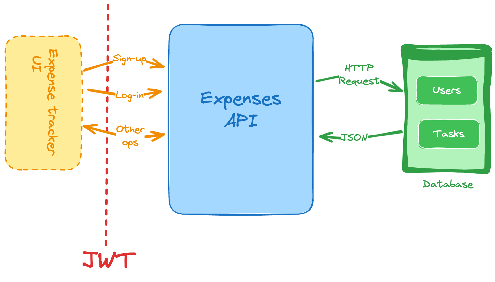

# Expense Tracker API

## Overview

The Expense Tracker API is a RESTful API that allows users to manage their expenses. Users can register, log in, and perform CRUD (Create, Read, Update, Delete) operations on their expenses. The API is built using Flask, with SQLITE as the database and JWT for authentication.



## Features

- User registration and authentication
- Create, read, update, and delete expenses
- Secure access to user-specific data
- JSON responses for all API interactions
- Input validation and error handling

## Technologies Used

- **Backend Framework:** Flask
- **Database:** SQLITE
- **Authentication:** JWT (JSON Web Tokens)
- **ORM:** SQLite (or raw SQL queries)
- **Environment:** Python 3.x

## Getting Started

### Prerequisites

- Python 3.x
- pip (Python package manager)

### Installation

1. **Clone the repository:**

   ```bash
   git clone https://github.com/sulaimonwasiu/expense-tracker-api.git
   cd expense-tracker-api
   ```

2. **Create a virtual environment:**

   ```bash
   python -m venv venv
   source venv/bin/activate  # On Windows use `venv\Scripts\activate`
   ```

3. **Install the required packages:**

   ```bash
   pip install -r requirements.txt
   ```

4. **Set up the database:**

   - Create a SQLITE database and user.
   - Update the database connection settings in your application.
   - Run the following SQL commands to create the required tables:

   ```sql
   DROP TABLE IF EXISTS user;
   DROP TABLE IF EXISTS expense;

   CREATE TABLE user (
     id SERIAL PRIMARY KEY,
     username TEXT UNIQUE NOT NULL,
     password TEXT NOT NULL
   );

   CREATE TABLE expense (
     id SERIAL PRIMARY KEY,
     description TEXT NOT NULL,
     amount REAL NOT NULL,
     date TIMESTAMP NOT NULL DEFAULT CURRENT_TIMESTAMP,
     user_id INTEGER,
     FOREIGN KEY (user_id) REFERENCES user (id)
   );
   ```

5. **Run the application:**

   ```bash
   python -m flask --app tracker run --debug
   ```

   The API will be available at `http://localhost:5000`.

## API Endpoints

### Authentication

#### Register User

- **POST** `/register`
- **Request Body:**
  ```json
  {
      "username": "string",
      "password": "string"
  }
  ```
- **Response:**
  - `201 Created` - User registered successfully.
  - `400 Bad Request` - If the username already exists or input validation fails.

#### Login User

- **POST** `/login`
- **Request Body:**
  ```json
  {
      "username": "string",
      "password": "string"
  }
  ```
- **Response:**
  - `200 OK` - Returns a JWT token.
  - `401 Unauthorized` - Invalid credentials.

### Expense Management

#### Get All Expenses

- **GET** `/expenses`
- **Headers:**
  - `Authorization: Bearer <your_jwt_token>`
- **Response:**
  - `200 OK` - Returns a list of expenses for the authenticated user.

#### Get Single Expense

- **GET** `/expenses/<int:expense_id>`
- **Headers:**
  - `Authorization: Bearer <your_jwt_token>`
- **Response:**
  - `200 OK` - Returns the expense details.
  - `404 Not Found` - If the expense does not exist or does not belong to the user.

#### Add Expense

- **POST** `/expenses`
- **Headers:**
  - `Authorization: Bearer <your_jwt_token>`
- **Request Body:**
  ```json
  {
      "description": "string",
      "amount": "number"
  }
  ```
- **Response:**
  - `201 Created` - Expense added successfully.
  - `400 Bad Request` - If required fields are missing.

#### Update Expense

- **PUT** `/expenses/<int:expense_id>`
- **Headers:**
  - `Authorization: Bearer <your_jwt_token>`
- **Request Body:**
  ```json
  {
      "description": "string",
      "amount": "number"
  }
  ```
- **Response:**
  - `200 OK` - Expense updated successfully.
  - `404 Not Found` - If the expense does not exist or does not belong to the user.

#### Delete Expense

- **DELETE** `/expenses/<int:expense_id>`
- **Headers:**
  - `Authorization: Bearer <your_jwt_token>`
- **Response:**
  - `200 OK` - Expense deleted successfully.
  - `404 Not Found` - If the expense does not exist or does not belong to the user.

## Usage Example with Postman

1. **Register a User:**
   - Send a `POST` request to `http://localhost:5000/register` with the request body.

2. **Login to Get JWT Token:**
   - Send a `POST` request to `http://localhost:5000/login` with the username and password.

3. **Add an Expense:**
   - Use the JWT token to authorize a `POST` request to `http://localhost:5000/expenses`.

4. **Get All Expenses:**
   - Send a `GET` request to `http://localhost:5000/expenses` with the JWT token in the headers.

5. **Update an Expense:**
   - Send a `PUT` request to `http://localhost:5000/expenses/<expense_id>` with the updated data.

6. **Delete an Expense:**
   - Send a `DELETE` request to `http://localhost:5000/expenses/<expense_id>`.

## Contributing

Contributions are welcome! Please open an issue or submit a pull request for any enhancements or fixes.

